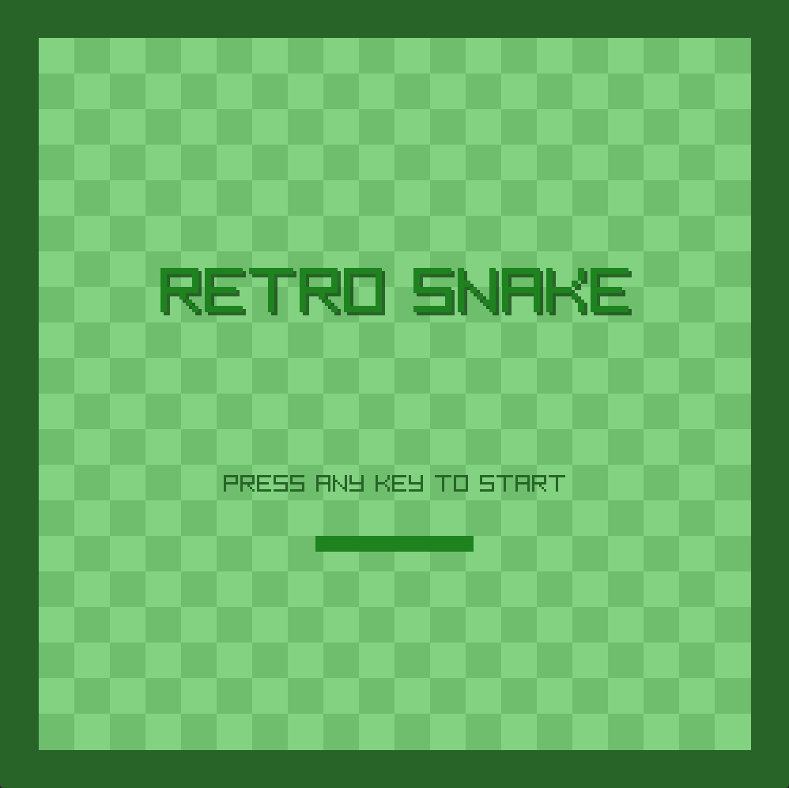
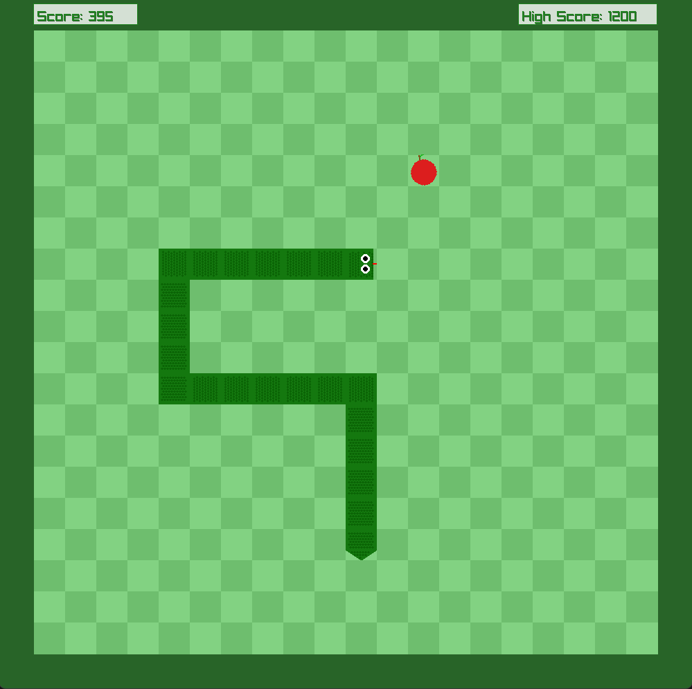
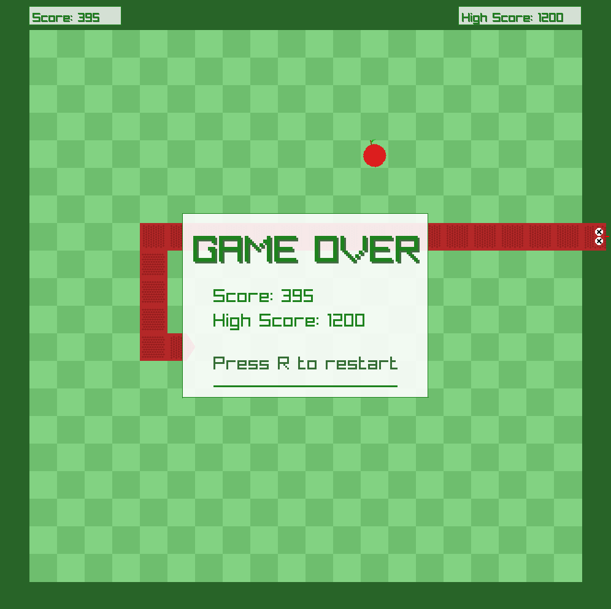

# Snake Game

A modern implementation of the classic Snake game with enhanced graphics and gameplay features.



## Description

This project is a C++ implementation of the classic Snake game using the Raylib graphics library. The game features custom pixel art graphics, special food types, and dynamic gameplay mechanics that increase difficulty as you progress.

## Features

- Fully animated snake with directional head, body, and tail segments
- Three different types of food with unique effects:
  - Normal Apple: Basic food that increases score by 10 points
  - Golden Apple: Rare food that gives 50 points
  - Frozen Apple: Slows down the snake temporarily but only gives 5 points
- Increasing difficulty: Snake speeds up as you collect more food
- Score display with animated floating text
- Custom pixel art graphics
- Sound effects and background music
- Game over state with dead snake visuals

## Technologies Used

- C++
- [Raylib](https://www.raylib.com/) - A simple and easy-to-use library to enjoy videogame programming
- Python (for graphics generation)

## Installation

### Prerequisites

- A C++ compiler (GCC, Clang, MSVC, etc.)
- Raylib library

### Building from Source

1. Clone this repository:
   ```
   git clone https://github.com/yourusername/snake.git
   cd snake
   ```

2. Generate the graphics assets (optional, pre-generated assets are included):
   ```
   python generateGraphics.py
   ```

3. Compile the game:
   ```
   # Using GCC
   g++ -o snake *.cpp -lraylib
   
   # Using MSVC
   cl /EHsc /Fesnake.exe *.cpp /link raylib.lib
   ```

4. Run the game:
   ```
   ./snake
   ```



## How to Play

- Control the snake using the arrow keys
- Eat apples to grow longer and increase your score
- Avoid running into walls or your own tail
- Look out for special apples:
  - Golden apples are worth more points
  - Frozen apples slow down the snake temporarily

## Controls

- **Arrow Up**: Move snake up
- **Arrow Down**: Move snake down
- **Arrow Left**: Move snake left
- **Arrow Right**: Move snake right

## Game Mechanics

- **Normal Apple**: Increases score by 10 points and increases snake speed slightly
- **Golden Apple**: Rare spawn (5% chance) that increases score by 50 points
- **Frozen Apple**: Uncommon spawn (10% chance) that increases score by 5 points and temporarily slows down the snake
- The snake speeds up as you collect more food, increasing difficulty
- Game ends when the snake hits a wall or itself

## Future Improvements

- Implement a pause menu
- Add difficulty levels
- Create a high score leaderboard
- Additional power-ups and obstacles

## Credits

- [Raylib](https://www.raylib.com/) for the graphics library
- [Google Snake](https://g.co/kgs/GjFn4tQ) for aesthetic inspiration
- [Programming With Nick](https://youtu.be/LGqsnM_WEK4?si=2xDC5W99HnYxpLGP) for initial pointers and guidance
- [8-bit Music](https://youtu.be/FpDWpX9luCQ?si=7t9QvYbhBY4o_XFY) for the awesome soundtrack!

